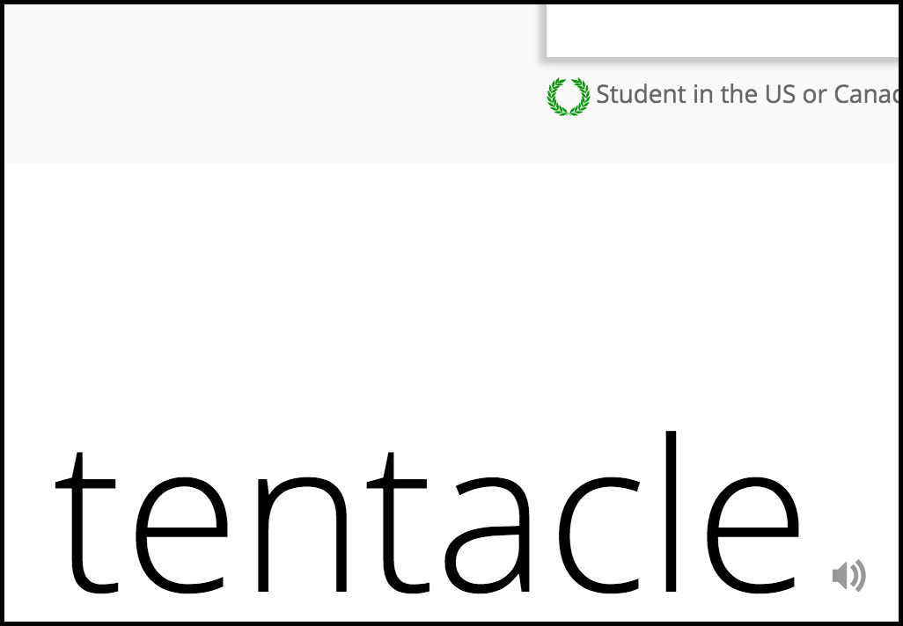
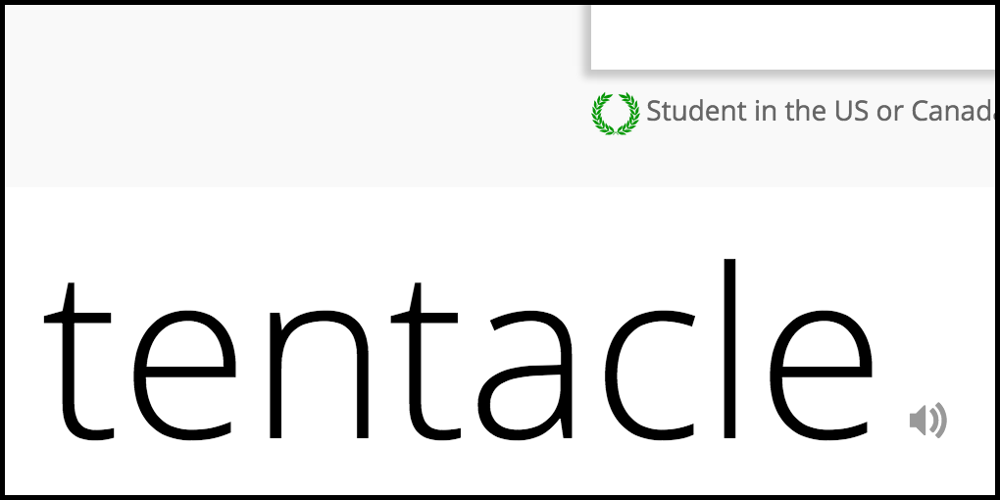

# MyVocab

MyVocab is a Chrome extension for [Vocabulary.com](http://www.vocabulary.com).

[Install it](https://chrome.google.com/webstore/detail/myvocab/npfplmfmbflbcffpkpgmhpinemlimnnc) from Chrome Web Store.

# Features

* Add links to other dictionary sites on word page.

Currently you can search in these sites directly from vocabulary.com page: Dictionary.com, Youdao, Etymonline, Google Images, Merriam Webster, FreeDictionary and Google Define.

* Fix progress gauge display when the page is zoomed.

Vocabulay.com have already fixed this.

(When the page is zoomed, the progress guage is misaligned due to Vocabulary.com's buggy CSS code. This is fixed by this extension (on some pages).)

* Reduce extra top margin on word header.

This saves more vertical space for useful stuff.

# Usage

Click anywhere on the page to show the extra buttons.

# Development

Test to be done after every change:

* The dictionary:
Open http://www.vocabulary.com/dictionary/vocabulary, the links should appear.

* The Challenge:
Answer the question, click the word in the round table, the links should appear
in the newly popped word definition. May need to test different kinds of
questions to ensure that the questions area are not messed up.

## Thanks

Powered by PyCharm under an [Open Source License](http://www.jetbrains.com/pycharm/buy/buy.jsp#openSource).
